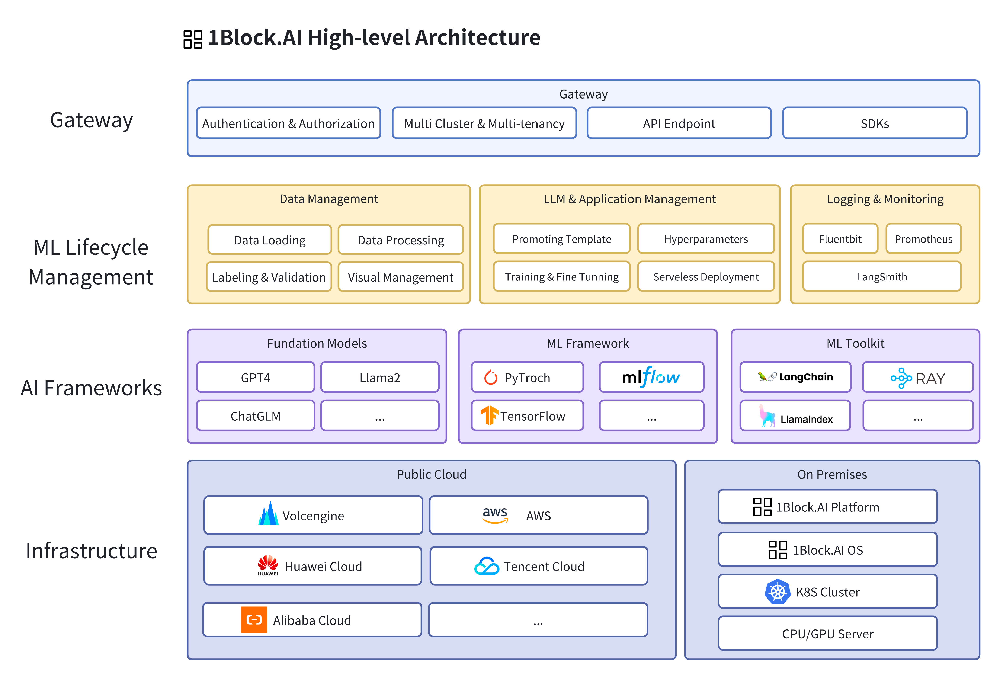

```go
func main() {
    fmt.Println("Hello World, @1Block.AI");
}
```

## Why We Build 1Block.AI
We believe that AGI (Artificial General Intelligence) is the next significant milestone in the human history. It will not only reshape how we live, work, and play but also revolutionize how we develop software.
We are building **1Block.AI** to assist both developers and non-developers in unlocking the power of LLMs, allowing them to construct their own generative AI applications using a single, unified management platform.

### What is 1Block.AI

**1Block.AI** is an open-source, cloud-native LLMOps platform that fosters innovation in LLMs and generative AI applications. It is built on top of cutting-edge technologies such as [Kubernetes](https://kubernetes.io/), [Ray.io](https://ray.io/), [vLLM](https://docs.vllm.ai/en/latest/index.html), etc., and designed to be cloud-agnostic and ML framework agnostic.

Projects like Ray(also KubeRay), and LangChain are excellent open-source projects for ML lifecycle management and can be served as the core components of the LLMOps. For instance, Ray offers powerful distributed computing capabilities and a comprehensive ML computing framework, forming a powerful ML foundation for the platform. However, they lack a unified solution for cluster management, multi-tenancy, cost control, data privacy protection, resource versioning, etc. 
These aspects need addressing in other components of the LLMOps platform. In essence, we believe a user-friendly LLMOps platform should encompass:

- **Cost-effectiveness and Data Privacy**: The platform must be open-source, feature a distributed architecture, and support private deployment.
- **Easy to Use**: Provide a unified interface for developers and non-developers to implement complete life cycle management of Large Language Models(LLM) and generative AI applications.
    - **Exploratory Data Analysis (EDA)**: Iteratively explore, share, and prepare data for the machine learning lifecycle by creating reproducible, editable, and shareable datasets, tables, and visual charts.
    - **Model Registration and Management**: Allow users to upload, track, and manage versions of models and associate them with specific datasets and hyperparameters.
    - **Continuous Integration/Continuous Deployment (CI/CD)**: Ensure the continuous updating and deployment of models and AI agents, enabling them to respond promptly to new data and changes.
    - **Performance Monitoring and Logging**: Real-time monitoring of model performance, including metrics such as inference time, memory usage, and logging all interactions for auditing and fine-tuning.
    - **Automated Tuning and Optimization**: Automatically adjust and optimize models using tools to maintain their optimal performance in different environments.
- **No Vendor Lock-in**: Compatible with different cloud infrastructures and different ML frameworks(cloud-agnostic & ML-agnostic).
- **Scalability and Portability**: Supports serverless deployment, provides a unified solution for LLMs and generative AI applications to be deployed anywhere, from public cloud to on-premise servers.
- **Interoperability and maintainability**: customizable and extendable with cloud-native and ML ecosystems.



## Join Us
We are excited to build a community around the project. If you're interested, please join us on [Discord](https://discord.gg/5BnNqC5ccB) or participate in [Github Discussions](https://github.com/llmos-ai/llmos/discussions) to discuss or contribute the project. We look forward to collaborating with you. Merci!
